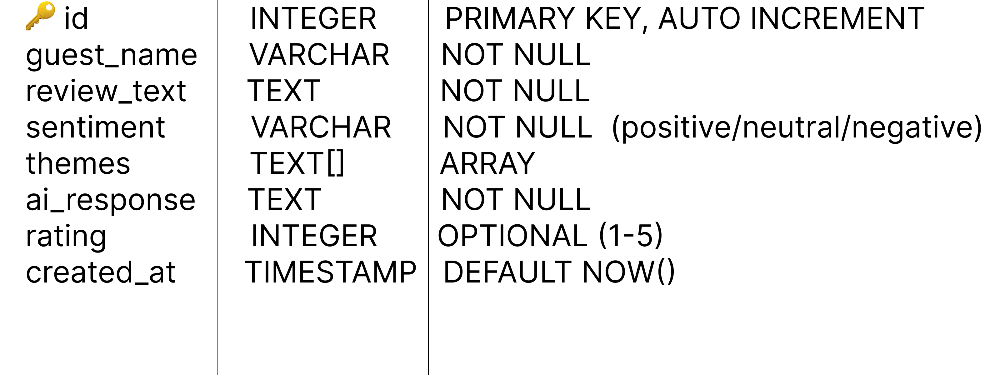

# Staylytics

AI-powered guest review analytics platform for homestay businesses across Uttarakhand.

---

## What it does

Staylytics helps homestay owners analyze guest feedback instantly — classify sentiment, detect themes, and generate professional responses — without reading every review manually.

---

## Tech Stack

| Layer | Technology |
|-------|-----------|
| Frontend | React, Vite, Tailwind CSS |
| Backend | Python, FastAPI |
| Database | PostgreSQL (Supabase) |
| AI | Gemini API (coming) |
| Deployment | Vercel (frontend), Render (backend) |

---

## Project Structure

```
Staylytics/
├── frontend/
│   ├── src/
│   │   ├── components/
│   │   │   ├── Navbar.jsx
│   │   │   ├── Hero.jsx
│   │   │   ├── Card.jsx
│   │   │   ├── Footer.jsx
│   │   │   └── ui/
│   │   │       ├── Button.jsx
│   │   │       ├── Input.jsx
│   │   │       ├── Modal.jsx
│   │   │       ├── Toast.jsx
│   │   │       ├── Loader.jsx
│   │   │       └── index.js
│   │   ├── pages/
│   │   │   ├── Login.jsx
│   │   │   └── Reviews.jsx
│   │   ├── context/
│   │   │   └── ThemeContext.jsx
│   │   └── services/
│   │       └── reviewsApi.js
└── backend/
    ├── main.py
    ├── database.py
    ├── requirements.txt
    ├── .env.example
    ├── models/
    │   └── review.py
    └── routes/
        └── reviews.py
```

---

## API Endpoints

| Method | Endpoint | Description |
|--------|----------|-------------|
| GET | `/reviews` | Get all reviews |
| GET | `/reviews/{id}` | Get single review |
| POST | `/reviews` | Create and analyze a review |
| PUT | `/reviews/{id}` | Update a review |
| DELETE | `/reviews/{id}` | Delete a review |
| GET | `/reviews/search` | Search and filter reviews |
| GET | `/health` | Health check |

---

## Database

**Choice: Supabase (PostgreSQL)**

We chose Supabase because:
- Hosted PostgreSQL with no infrastructure setup required
- Simple Python client library
- Built-in dashboard to view and manage data
- Free tier sufficient for development
- Easy to scale

### Schema

```sql
CREATE TABLE public.reviews (
  id SERIAL PRIMARY KEY,
  guest_name VARCHAR(255) NOT NULL,
  review_text TEXT NOT NULL,
  sentiment VARCHAR(50) NOT NULL,
  themes TEXT[] NOT NULL DEFAULT '{}',
  ai_response TEXT NOT NULL,
  rating INTEGER CHECK (rating >= 1 AND rating <= 5),
  created_at TIMESTAMP DEFAULT NOW()
);
```
### Schema Diagram



### Set up the database

1. Go to [supabase.com](https://supabase.com) and create a free account
2. Create a new project named `staylytics`
3. Go to **SQL Editor** and run the schema above
4. Go to **Settings → API Keys** and copy your Project URL and anon key
5. Add them to your `.env` file

---

## How to Run Locally

### Frontend

```bash
cd frontend
npm install
npm run dev
```

Runs at: `http://localhost:5173`

### Backend

```bash
cd backend

# Create virtual environment
python -m venv venv

# Activate (Windows)
venv\Scripts\activate

# Install dependencies
pip install -r requirements.txt

# Set up environment variables
cp .env.example .env
# Fill in your Supabase credentials in .env

# Run server
uvicorn main:app --reload
```

Runs at: `http://localhost:8000`

API docs at: `http://localhost:8000/docs`

---

## Environment Variables

Copy `.env.example` to `.env` and fill in your values:

```
SUPABASE_URL=https://your-project-id.supabase.co
SUPABASE_KEY=your_supabase_anon_key
FRONTEND_URL=http://localhost:5173
GEMINI_API_KEY=your_gemini_api_key_here
```

---

## Features

- AI sentiment classification — positive, neutral, negative
- Theme detection — Food, Host, Cleanliness, Location, WiFi, Experience
- AI-generated response drafts for each review
- Review history with search and filter
- Dark / Light mode toggle
- Fully responsive — mobile, tablet, desktop
- Login page with form validation
- UI component library — Button, Input, Modal, Toast, Loader
